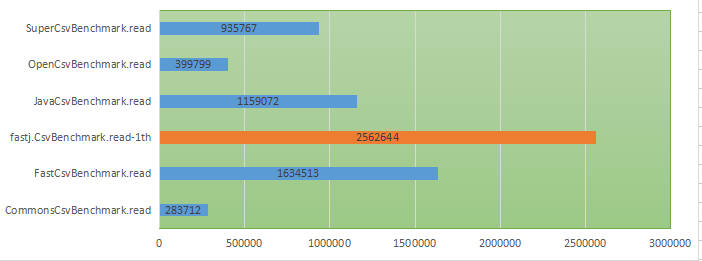

# fastcsv
A fast CSV multi-thread reader

## Main characteristics：
- Reads by column, reduces unnecessary object generation, reduces memory usage, and increases processing speed
- Multi-threaded processing, file read thread, processing thread can be flexibly configured (must be a power of 2 before processing the number of threads)

## Example：

        String file = ...
        String [] cols = ...
        double[][] data = CSV.readMatrix(file, cols, 4, 8, 0);
    
        String[][] d2 = CSV.readCsv(file, cols, true, 4, 1, 0);

        
## Single-threaded pure parsing performance
- （Test code modified from）：

## 【Test instruction】

       Above performance test，does not involve disk network，just for memory data processing speed，and don t save the data，There is a big gap with real reading.
       
       Real data test (i7 4core 8thread, 12 GB memory):
       300MB, 482 columns per row, a total of 50,000 lines csv，Reading String[][] takes about 0.3-1.5 seconds (severely affected by GC)，Reading double[][] takes 0.45-0.6 seconds
       When the number of multi-core server threads is sufficient, the performance will be more obvious.
      
       
## Finally

- This open source code removes parts of the GPL copyright，This part of the code mainly contains less memory usage.，and processing acceleration
- The optimization part of JDK9 or later is not reflected

